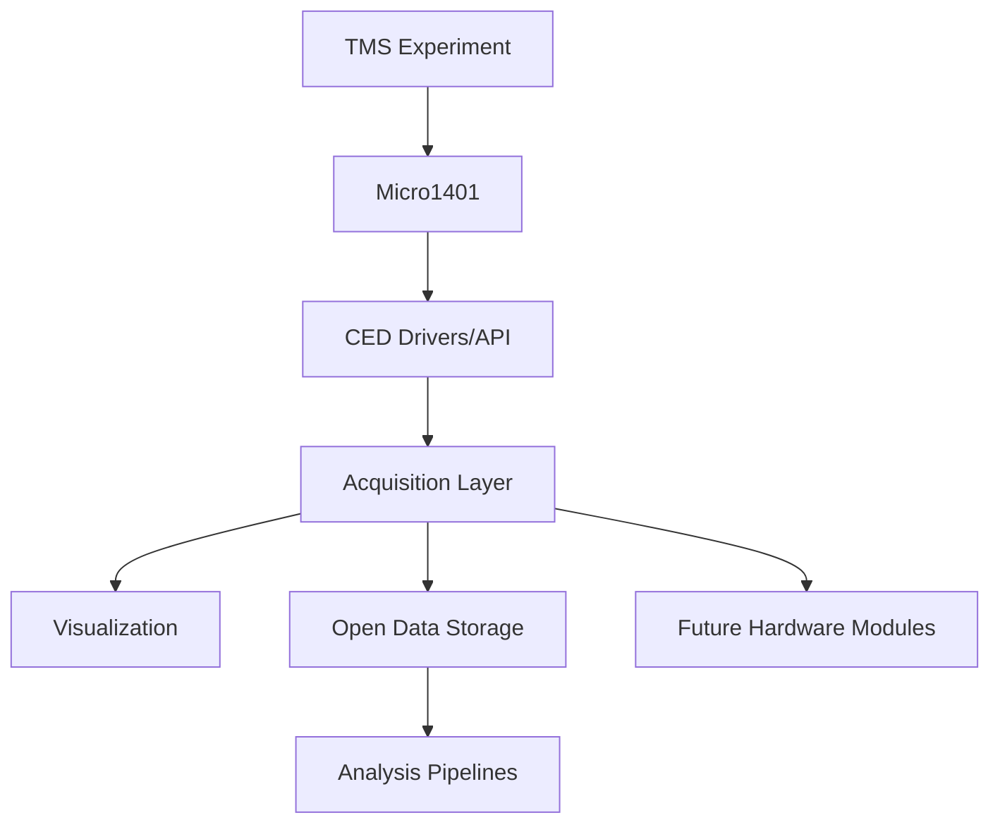
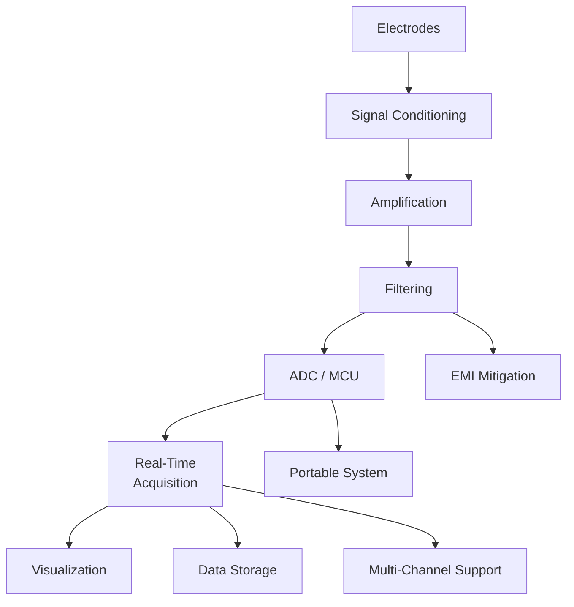
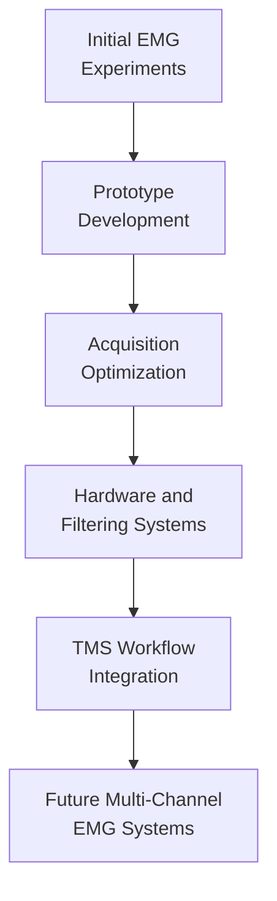

# Development of Lightweight Real-Time EMG Acquisition and Experimental Hardware Pipelines for TMS Research

## Dheeraj Murthy, Lesin
International Institute of Information Technology Bangalore (IIIT Bangalore)  
Collaboration with NIMHANS

---

# Proposal / Abstract

Transcranial Magnetic Stimulation (TMS) experiments require reliable Electromyography (EMG) signal acquisition to measure Motor Evoked Potentials (MEPs) and support neuroscience research. Current workflows rely heavily on proprietary acquisition software, limiting flexibility, automation, and real-time control while increasing dependence on closed research systems.

This project proposes the development of a lightweight real-time EMG acquisition system for TMS experiments using direct communication with Micro1401 hardware through CED drivers. The proposed system aims to support continuous EMG acquisition, live visualization, automated logging, and open-format data storage for integration with modern research and analysis tools.

In parallel, the project also proposes the development of a separate experimental EMG hardware pipeline focused on low-cost and modular acquisition hardware. Proposed work includes amplification and filtering circuits, noise reduction mechanisms, portable acquisition modules, and standardized signal conditioning approaches to improve acquisition stability and signal quality.

The combined software and hardware framework aims to create an affordable and research-friendly EMG platform for neuroscience, neuroengineering, rehabilitation systems, and biomedical signal analysis.

---

# 1. Introduction and Motivation

Transcranial Magnetic Stimulation (TMS) is a non-invasive neurostimulation technique used in neuroscience and psychiatric research. During TMS experiments, magnetic pulses stimulate cortical neurons, producing measurable muscular responses known as Motor Evoked Potentials (MEPs). These responses are captured using Electromyography (EMG) systems.

Most current TMS workflows rely on proprietary EMG acquisition software and hardware ecosystems. While functional, these systems often introduce limitations including high cost, restricted automation, poor flexibility for data analysis, unstable software environments, and dependence on closed research infrastructure.

Preliminary investigations using low-cost EMG systems also suggest that EMG acquisition is highly sensitive to electrical interference, unstable power conditions, electrode placement, and patch degradation.

This project aims to address these challenges through the development of lightweight software and experimental hardware pipelines for real-time EMG acquisition in TMS research.

---

# 2. Problem Statement

Major challenges identified in current EMG acquisition workflows include:

- Heavy and unstable software environments
- Limited real-time control
- Restricted export and interoperability
- Poor automation support
- Dependence on proprietary ecosystems
- Difficulty integrating with custom pipelines

Preliminary EMG experimentation also suggests several signal reliability challenges:

- Electrical interference (EMI)
- Signal instability under low power
- Sensitivity to electrode placement
- Signal degradation due to patch reuse

These issues reduce the flexibility and reproducibility of neuroscience experiments.

---

# 3. System Overview

---

# 4. Project Objectives

## Software Objectives

- Develop a real-time EMG acquisition system using Micro1401 hardware
- Enable live signal visualization
- Support open-format storage and export
- Improve acquisition throughput and responsiveness
- Reduce dependence on proprietary software

## Hardware Objectives

- Explore development of low-cost modular EMG acquisition hardware
- Design signal conditioning and amplification pipelines
- Investigate methods for noise reduction and EMI mitigation
- Develop portable acquisition modules
- Improve acquisition stability and signal quality

---

# 5. Proposed Work

## 5.1 Initial EMG Investigation

Initial work focuses on understanding practical challenges involved in EMG signal acquisition using a low-cost EMG sensor module integrated with an Arduino-based acquisition setup.

The proposed setup includes:

- EMG sensor module
- Arduino-based analog acquisition
- Surface electrodes
- Python-based visualization and logging

This stage aims to establish a foundational understanding of signal behavior, hardware limitations, and environmental noise sources affecting EMG acquisition.

---

## 5.2 Controlled Noise Experiments

Controlled experiments are proposed to identify contributors to EMG signal degradation.

### Power Supply Stability

The study aims to evaluate the effect of unstable voltage conditions on signal reliability and acquisition stability.

### Electrical Interference (EMI)

Experiments will investigate the impact of nearby electronic devices and charging systems on baseline EMG signal quality.

### Electrode Placement and Patch Reusability

The work also aims to study the effect of electrode positioning and patch degradation on signal consistency.

These investigations are expected to help guide the design of improved filtering and signal conditioning mechanisms.

---

# 6. Real-Time TMS EMG Acquisition Pipeline

The project proposes the development of a dedicated EMG acquisition pipeline for TMS experiments.

The proposed architecture consists of:

- Direct communication with Micro1401 hardware using CED drivers
- Continuous EMG signal acquisition
- Real-time visualization
- Open-format data storage
- Automated logging mechanisms

An initial Python-based prototype is proposed for rapid experimentation and feasibility evaluation.

---

# 7. Performance Optimization

Initial development work suggests that higher-level implementations may introduce performance limitations during real-time acquisition.

Optimization efforts are therefore focused on exploring native C++ acquisition pipelines to improve:

- Acquisition throughput
- Real-time responsiveness
- Visualization performance
- Reduced acquisition bottlenecks

Future evaluation will focus on benchmarking performance under practical TMS experimental conditions.

---

# 8. Experimental Goals and Expected Observations

The proposed work aims to investigate several practical factors affecting EMG acquisition reliability.

## Key Areas of Investigation

- Electrical interference as a major noise source
- Effect of voltage stability on acquisition reliability
- Impact of electrode quality and placement
- Performance differences between prototype implementations

These investigations are expected to help establish design requirements for future acquisition systems and hardware development.

---

# 9. Future Work

## Software Expansion

Future software work may include:

- Graphical experiment control interfaces
- Automated MEP detection
- Real-time filtering and preprocessing
- Integration with stimulation triggers
- Multi-channel acquisition support

## Hardware Development

Future hardware research may include:

- Custom EMG signal conditioning boards
- Amplification and filtering circuitry
- Electrical isolation and EMI mitigation systems
- Portable acquisition modules
- Battery-powered experimental systems
- Multi-channel EMG acquisition hardware

The long-term objective is to create an affordable open research platform for neuroscience and neuroengineering applications.

---

# 10. Future Hardware Pipeline

---

# 11. Research Impact

Potential impact areas include:

- Reduced dependence on proprietary acquisition systems
- Affordable experimental platforms for smaller labs
- Faster neuroscience workflows
- Open and reproducible research infrastructure
- Support for future neuroengineering research

---

# 12. Roadmap

---

# 13. Conclusion

This project proposes the development of lightweight EMG acquisition systems for TMS research using open and customizable software and hardware pipelines.

The proposed work aims to investigate:

- Real-time EMG acquisition using Micro1401 hardware
- Open-format storage and visualization workflows
- Optimization of native acquisition implementations
- Practical challenges affecting EMG reliability

Future expansion into modular hardware systems and advanced signal analysis pipelines may help create affordable and research-friendly infrastructure for neuroscience and biomedical engineering applications.